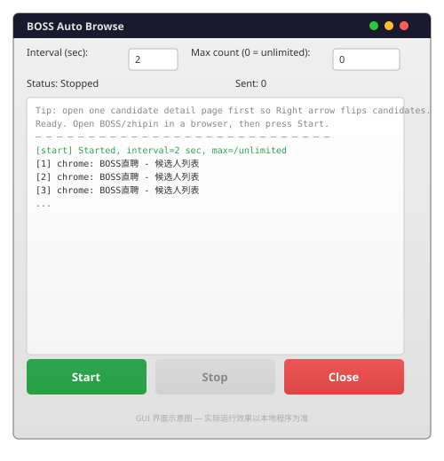
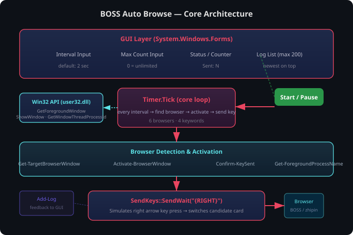

# BOSS Auto Browse

<p align="center">
  
</p>

<p align="center">
  <a href="https://github.com/LPK3215/boss_auto_browse/releases"></a>
  <a href="https://github.com/LPK3215/boss_auto_browse/blob/main/LICENSE"></a>
  <a href="https://github.com/LPK3215/boss_auto_browse"></a>
  <a href="https://github.com/LPK3215/boss_auto_browse"></a>
  <a href="https://github.com/LPK3215/boss_auto_browse"></a>
  <a href="https://github.com/LPK3215/boss_auto_browse/stargazers"></a>
</p>

> 给女朋友做的一个便捷小工具，定时向浏览器发送右箭头键，自动切换 BOSS 直聘候选人卡片。

## 关于这个项目

这是一个开源玩具。最初就是给女朋友做了一个在 BOSS 直聘上自动浏览候选人的小工具，顺手开源了。

它没有什么重大意义，使用场景也很固定——就是定时按右箭头键而已。核心只有一个 PowerShell 脚本，逻辑简单，所以项目很好维护，也不会有什么大的变动。

## 界面预览

<p align="center">
  
</p>

<!-- TODO: 截图待补充 — 可运行程序后截取实际运行画面替换此 SVG -->

## 核心架构

<p align="center">
  
</p>

## 功能特性

- **定时自动按键**：按设定间隔（默认 2 秒）自动发送 `→` 右箭头键
- **多浏览器支持**：Chrome、Edge、Firefox、Brave、Opera、Tabbit
- **智能窗口定位**：优先激活标题含 "BOSS"/"Boss"/"boss"/"zhipin" 的浏览器窗口
- **可配置参数**：自定义间隔时间（秒）和最大发送次数（0 = 无限）
- **实时日志**：GUI 内嵌日志列表，记录每次操作和状态变化
- **暂停/恢复/停止**：运行中可随时暂停、恢复或停止并重置计数

## 快速开始

### 环境要求

- Windows 10/11
- PowerShell 5.1 或更高版本（Windows 自带）
- 任意支持的浏览器（Chrome、Edge、Firefox、Brave、Opera、Tabbit）

### 运行方式

**方式一：双击启动（推荐）**

双击 `run.bat` 即可启动 GUI。

**方式二：命令行运行**

```powershell
powershell -ExecutionPolicy Bypass -NoProfile -File boss_auto_browse_gui.ps1
```

### 使用步骤

1. 在浏览器中打开 BOSS 直聘，进入候选人/职位详情页
2. 运行 `run.bat` 启动程序
3. 设置 **间隔时间**（秒）和 **最大次数**（0 = 无限）
4. 点击 **Start** 开始自动浏览
5. 可随时点击 **Pause** 暂停，再次点击 **Resume** 恢复
6. 点击 **Stop** 停止并重置计数

> **提示**：需先打开一个候选人/职位详情页，右箭头键才能在候选人之间切换。

## 可视化文档

- **[全景观览页](project_overview.html)** — 沉浸式项目仪表盘，双击打开即可在浏览器中俯瞰项目全貌
- **[项目名片](project_overview/project_card.html)** — 精简版长图名片，一键导出 PNG 分享给他人

## 项目结构

```
boss_auto_browse/
├── boss_auto_browse_gui.ps1  # 主程序源码（PowerShell GUI 脚本，246 行）
├── boss_auto_browse_gui.exe   # 编译版可执行文件
├── run.bat                    # 双击启动器
├── docs/
│   ├── banner.svg             # 项目横幅
│   ├── architecture.svg       # 核心架构图
│   ├── gui_preview.svg        # GUI 界面示意图
│   └── scripts/
│       └── generate_assets.py # SVG 生成脚本（可复用）
├── project_overview.html       # 全景观览页入口
├── project_overview/
│   ├── index.html              # 全景观览页
│   ├── style.css               # 全景观览页样式
│   ├── script.js               # 全景观览页交互
│   ├── project_card.html       # 精简版名片长图（可导出 PNG）
│   └── assets/                 # 外部资源目录
├── LICENSE                    # MIT 开源许可证
├── README.md                  # 项目说明文档
├── CONTRIBUTING.md            # 贡献指南
├── CHANGELOG.md               # 版本变更记录
├── FAQ.md                     # 常见问题
├── AUTHORS                    # 作者信息
├── .gitignore                 # Git 忽略规则
└── .gitattributes             # Git 行尾规范
```

## 技术实现

- **语言**：PowerShell
- **GUI 框架**：`System.Windows.Forms` + `System.Drawing`
- **Win32 API**：通过 P/Invoke 调用 `user32.dll` 实现窗口激活与焦点检测
- **按键模拟**：`SendKeys::SendWait("{RIGHT}")`
- **窗口激活**：`WScript.Shell` COM 对象的 `AppActivate` 方法

### 核心逻辑

| 函数 | 职责 |
|---|---|
| `Get-ForegroundProcessName` | 获取当前前台窗口对应的进程名 |
| `Get-TargetBrowserWindow` | 查找 BOSS 直聘相关的浏览器窗口 |
| `Activate-BrowserWindow` | 激活目标浏览器窗口到前台 |
| `Confirm-KeySent` | 确认按键发送后焦点仍在浏览器中 |
| `Add-Log` | 向日志列表添加一条记录 |

## 常见问题

见 [FAQ.md](FAQ.md)。

## 贡献

项目很小，但欢迎提交 Issue 和 Pull Request。请先阅读 [贡献指南](CONTRIBUTING.md)。

## 开源许可

本项目基于 [MIT License](LICENSE) 开源，可自由使用、修改和分发。

## 作者

**LPK3215** · [GitHub](https://github.com/LPK3215) · 17538703215@163.com

完整作者信息见 [AUTHORS](AUTHORS)。

## 免责声明

本项目仅供学习和个人使用。使用者需自行承担使用风险，请遵守 BOSS 直聘的相关服务条款。作者不对因使用本工具而产生的任何后果承担责任。
